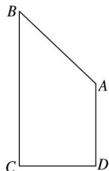

<!-- question-source:start -->
(4)如图所示，在直角梯形 ABCD 中， $AD \perp DC$ ， $AD \parallel BC$ ，BC = 2CD = 2AD = 2，若将该直角梯形绕 BC 边旋转一周，则所得的几何体的表面积为 \_\_\_\_。

<!-- question-source:end -->

![[高中/总复习/专题/立体几何/专题06 立体几何中的面积与体积问题-立体几何（文理通用）/考点01_几何体的面积问题/例题/answers/Q00043536A1.md]]
