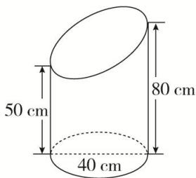

<!-- question-source:start -->
(7)在如图所示的斜截圆柱中, 已知圆柱底面的直径为 $40 \mathrm{~cm}$ , 母线长最短 $50 \mathrm{~cm}$ , 最长 $80 \mathrm{~cm}$ , 则斜截圆柱的侧面面积 $S =$ \_\_\_\_ $\mathrm{cm}^{2}$ .

<!-- question-source:end -->

![[高中/总复习/专题/立体几何/专题06 立体几何中的面积与体积问题-立体几何（文理通用）/考点01_几何体的面积问题/例题/answers/Q00043539A1.md]]
