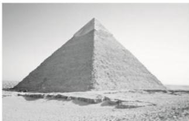

<!-- question-source:start -->
(8)(2020·全国I)埃及胡夫金字塔是古代世界建筑奇迹之一，它的形状可视为一个正四棱锥，以该四棱锥的高为边长的正方形面积等于该四棱锥一个侧面三角形的面积，则其侧面三角形底边上的高与底面正方形的边长的比值为()

A. $\frac{\sqrt{5} - 1}{4}$ B. $\frac{\sqrt{5} - 1}{2}$ C. $\frac{\sqrt{5} + 1}{4}$ D. $\frac{\sqrt{5} + 1}{2}$
<!-- question-source:end -->

![[高中/总复习/专题/立体几何/专题06 立体几何中的面积与体积问题-立体几何（文理通用）/考点01_几何体的面积问题/例题/answers/Q00043540A1.md]]
