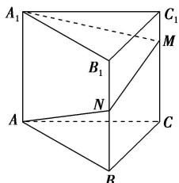

<!-- question-source:start -->
(9)已知三棱柱 $ABC - A_{1}B_{1}C_{1}$ 的侧棱垂直于底面，且底面边长与侧棱长都等于3．蚂蚁从 $A$ 点沿侧面经过棱 $BB_{1}$ 上的点 $N$ 和 $CC_{1}$ 上的点 $M$ 爬到点 $A_{1}$ ，如图所示，则蚂蚁爬过的路程最短为 \_\_\_\_.

<!-- question-source:end -->

![[高中/总复习/专题/立体几何/专题06 立体几何中的面积与体积问题-立体几何（文理通用）/考点01_几何体的面积问题/例题/answers/Q00043541A1.md]]
