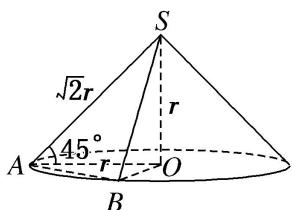

> [!faq]- 《专题06 立体几何中的面积与体积问题-立体几何（文理通用）》例题解析
>
> > [!success]- **【答案】** 详见解析
>
> > [!note]- **【分析】**
> > 本题未单列分析。
>
> > [!note]- **【解析】**
> > 答案 $40\sqrt{2}\pi$ 解析如图， $\because SA$ 与底面成45角， $\therefore \triangle SAO$ 为等腰直角三角形．设 $OA = r$ ，则 $SO = r$ $SA = SB = \sqrt{2} r.$ 在 $\triangle SAB$ 中， $\cos \angle ASB = \frac{7}{8},\therefore \sin \angle ASB = \frac{\sqrt{15}}{8},\therefore S_{\triangle SAB} = \frac{1}{2} SA\cdot SB\cdot \sin \angle ASB = \frac{1}{2}\times (\sqrt{2} r)^2$ $\times \frac{\sqrt{15}}{8} = 5\sqrt{15}$ ，解得 $r = 2\sqrt{10},\therefore SA = \sqrt{2} r = 4\sqrt{5}$ ，即母线长 $l = 4\sqrt{5},\therefore S_{\text{圆锥侧}} = \pi rl = \pi \times 2\sqrt{10}\times 4\sqrt{5} = 40\sqrt{2}\pi .$
> >
> > 
