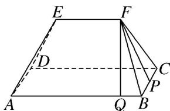

> [!faq]- 《专题06 立体几何中的面积与体积问题-立体几何（文理通用）》例题解析
>
> > [!success]- **【答案】** B
>
> > [!note]- **【解析】**
> > 答案 B 解析 如图所示，取 BC 的中点 P，连接 PF，则 $PF \perp BC$ ，过 F 作 $FQ \perp AB$ ，垂足为 Q。因为 $\triangle ADE$ 和 $\triangle BCF$ 都是边长为 2 的等边三角形，且 $EF \parallel AB$ ，所以四边形 ABFE 为等腰梯形， $FP = \sqrt{3}$ ，则 $BQ = \frac{1}{2}(AB - EF) = 1$ ， $FQ = \sqrt{BF^{2} - BQ^{2}} = \sqrt{3}$ ，所以 $S_{梯形 EFBA} = S_{梯形 EFCD} = \frac{1}{2} \times (2 + 4) \times \sqrt{3} = 3\sqrt{3}$ ，又 $S_{\triangle ADE} = S_{\triangle BCF} = \frac{1}{2} \times 2 \times \sqrt{3} = \sqrt{3}$ ， $S_{矩形 ABCD} = 4 \times 2 = 8$ ，所以该几何体的表面积 $S = 3\sqrt{3} \times 2 + \sqrt{3} \times 2 + 8 = 8 + 8\sqrt{3}$ 。故选 B.
> >
> > 
