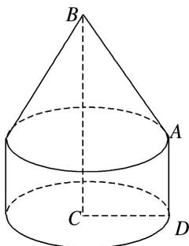

> [!faq]- 《专题06 立体几何中的面积与体积问题-立体几何（文理通用）》例题解析
>
> > [!success]- **【答案】** 详见解析
>
> > [!note]- **【分析】**
> > 本题未单列分析。
>
> > [!note]- **【解析】**
> > 答案 $(\sqrt{2} + 3)\pi$ 解析 根据题意可知，此旋转体的上半部分为圆锥(底面半径为1，高为1)，下半部分为圆柱(底面半径为1，高为1)，如图所示．则所得几何体的表面积为圆锥的侧面积、圆柱的侧面积以及圆柱的下底面积之和，即表面积为 $\frac{1}{2}\cdot 2\pi \cdot 1\cdot \sqrt{1^2 + 1^2} + 2\pi \cdot 1^2 + \pi \cdot 1^2 = (\sqrt{2} + 3)\pi.$
> >
> > 
