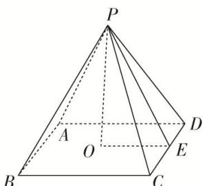

> [!faq]- 《专题06 立体几何中的面积与体积问题-立体几何（文理通用）》例题解析
>
> > [!success]- **【答案】** C
>
> > [!note]- **【解析】**
> > 答案 C 解析 如图，设 CD=a，PE=b，则 $PO=\sqrt{PE^{2}-OE^{2}}=\sqrt{b^{2}-\frac{a^{2}}{4}}$ ，由题意，得 $PO^{2}=\frac{1}{2}ab$ ，即 $b^{2}-\frac{a^{2}}{4}=\frac{1}{2}ab$ ，化简，得 $4\left(\frac{b}{a}\right)^{2}-2\cdot\frac{b}{a}-1=0$ ，解得 $\frac{b}{a}=\frac{\sqrt{5}+1}{4}$ （负值舍去）。故选 C.
> >
> > 
