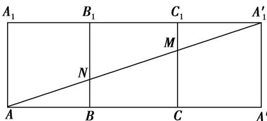

> [!faq]- 《专题06 立体几何中的面积与体积问题-立体几何（文理通用）》例题解析
>
> > [!success]- **【答案】** 详见解析
>
> > [!note]- **【分析】**
> > 本题未单列分析。
>
> > [!note]- **【解析】**
> > 答案 $3\sqrt{10}$ 解析 将三棱柱 $ABCA_{1}B_{1}C_{1}$ 的侧面展开如图所示，则有 $A^{\prime}A^{\prime}_{1} = 3, AA^{\prime}_{1} = \sqrt{(AA^{\prime})^{2} + (A^{\prime}A^{\prime}_{1})^{2}} = 3\sqrt{10}$ . 所以蚂蚁爬过的路程最短为 $AA^{\prime}_{1}$ .
> > 
