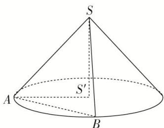

> [!faq]- 《专题06 立体几何中的面积与体积问题-立体几何（文理通用）》例题解析
>
> > [!success]- **【答案】** 详见解析
>
> > [!note]- **【分析】**
> > 本题未单列分析。
>
> > [!note]- **【解析】**
> > 答案 $40\sqrt{2}\pi$ 解析 如图所示，设 $S$ 在底面的射影为 $S'$ ，连接 $AS'$ ， $SS'$ 。△ $SAB$ 的面积为 $\frac{1}{2} \cdot SA \cdot SB \cdot \sin \angle ASB = \frac{1}{2} \cdot SA^2 \cdot \sqrt{1 - \cos^2 \angle ASB} = \frac{\sqrt{15}}{16} \cdot SA^2 = 5\sqrt{15}$ ，所以 $SA^2 = 80$ ， $SA = 4\sqrt{5}$ 。因为 $SA$ 与底面所成的角为 $45^\circ$ ，所以 $\angle SAS' = 45^\circ$ ， $AS' = SA \cdot \cos 45^\circ = 4\sqrt{5} \times \frac{\sqrt{2}}{2} = 2\sqrt{10}$ 。所以底面周长 $l = 2\pi \cdot AS' = 4\sqrt{10}\pi$ ，所以圆锥的侧面积为 $\frac{1}{2} \times 4\sqrt{5} \times 4\sqrt{10}\pi = 40\sqrt{2}\pi$ 。
> >
> > 
