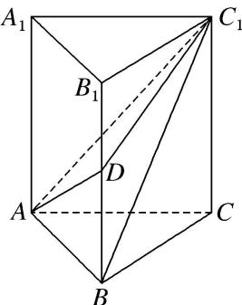

<!-- question-source:start -->
(3)如图, 在直三棱柱 $ABC - A_{1}B_{1}C_{1}$ 中, $AB = 1$ , $BC = 2$ , $BB_{1} = 3$ , $\angle ABC = 90^{\circ}$ ; 点 $D$ 为侧棱 $BB_{1}$ 上的动点. 当 $AD + DC_{1}$ 最小时, 三棱锥 $D - ABC_{1}$ 的体积为 \_\_\_\_.

<!-- question-source:end -->

![[高中/总复习/专题/立体几何/专题06 立体几何中的面积与体积问题-立体几何（文理通用）/考点02_几何体的体积问题/例题/answers/Q00043545A1.md]]
