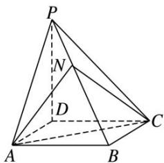

<!-- question-source:start -->
(4)如图, 四棱锥 P—ABCD 的底面 ABCD 为平行四边形, NB=2PN, 则三棱锥 N—PAC 与三棱锥 D—PAC 的体积比为()

A. $1:2$ B. $1:8$ C. $1:6$ D. $1:3$
<!-- question-source:end -->

![[高中/总复习/专题/立体几何/专题06 立体几何中的面积与体积问题-立体几何（文理通用）/考点02_几何体的体积问题/例题/answers/Q00043546A1.md]]
