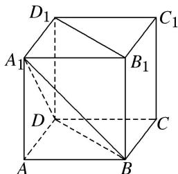

<!-- question-source:start -->
(8)(2018·天津)如图, 已知正方体 $ABCD - A_{1}B_{1}C_{1}D_{1}$ 的棱长为 1 , 则四棱锥 $A_{1} - BB_{1}D_{1}D$ 的体积为 \_\_\_\_.

<!-- question-source:end -->

![[高中/总复习/专题/立体几何/专题06 立体几何中的面积与体积问题-立体几何（文理通用）/考点02_几何体的体积问题/例题/answers/Q00043550A1.md]]
