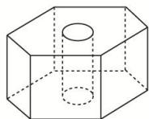
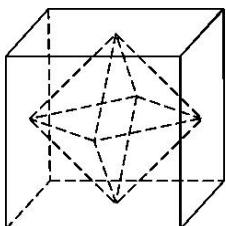
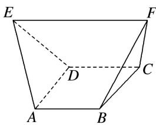

> [!faq]- 《专题06 立体几何中的面积与体积问题-立体几何（文理通用）》例题解析
>
> > [!success]- **【答案】** B
>
> > [!note]- **【分析】**
> > 本题未单列分析。
>
> > [!note]- **【解析】**
> > 答案 B 解析 圆锥的轴截面如图所示，设圆柱底面半径为 r，其中 0<r<2。由题意可知 $\triangle AO_{1}D\sim\triangle AO_{2}C$ ，则有 $\frac{AO_{1}}{O_{1}D}=\frac{AO_{2}}{O_{2}C}=2$ ，所以 $AO_{1}=2r$ ，则圆柱的高 h=4-2r，圆柱的侧面积 $S=2\pi r(4-2r)=4\pi(-r^{2}+2r)=4\pi$ ，整理得 $r^{2}-2r+1=0$ ，解得 r=1。当 r=1 时，h=2，所以该圆柱的体积 $V=\pi r^{2}h=2\pi$ 。故选 B.
> > 
> > (2)(2020·江苏)如图, 六角螺帽毛坯是由一个正六棱柱挖去一个圆柱所构成的. 已知螺帽的底面正六边形边长为 $2 \mathrm{~cm}$ , 高为 $2 \mathrm{~cm}$ , 内孔半径为 $0.5 \mathrm{~cm}$ , 则此六角螺帽毛坯的体积是 $\mathrm{cm}^{3}$ .
> > 
> > 答案 $12\sqrt{3} - \frac{\pi}{2}$ 解析 正六棱柱的体积为 $6 \times \frac{\sqrt{3}}{4} \times 2^2 \times 2 = 12\sqrt{3} \mathrm{~cm}^3$ ，挖去的圆柱的体积为 $\pi \left( \frac{1}{2} \right)^2 \times 2 = \frac{\pi}{2} \mathrm{~cm}^3$ ，故所求几何体的体积为 $\left(12\sqrt{3} - \frac{\pi}{2}\right) \mathrm{~cm}^3$ .
> > (3)如图, 在直三棱柱 $ABC - A_{1}B_{1}C_{1}$ 中, $AB = 1$ , $BC = 2$ , $BB_{1} = 3$ , $\angle ABC = 90^{\circ}$ ; 点 $D$ 为侧棱 $BB_{1}$ 上的动点. 当 $AD + DC_{1}$ 最小时, 三棱锥 $D - ABC_{1}$ 的体积为 \_\_\_\_.
> > 
> > 答案 $\frac{1}{3}$ 解析 将平面 $AA_{1}B_{1}B$ 沿着 $B_{1}B$ 旋转到与平面 $CC_{1}B_{1}B$ 在同一平面上(点 $B$ 在线段 $AC$ 上)，连接 $AC_{1}$ 与 $B_{1}B$ 相交于点 $D$ ，此时 $AD + DC_{1}$ 最小， $BD = \frac{1}{3} CC_{1} = 1$ 。因为在直三棱柱中， $BC \perp AB$ ， $BC \perp BB_{1}$ ，且 $BB_{1} \cap AB = B$ ，所以 $BC \perp$ 平面 $AA_{1}B_{1}B$ ，又 $CC_{1} //$ 平面 $AA_{1}B_{1}B$ ，所以 $V_{\text{三棱锥 } DABC_{1}} = V_{\text{三棱锥 } C_{1}ABD} = V_{\text{三棱锥 } CABD} = \frac{1}{3} S_{\triangle ABD} \cdot BC = \frac{1}{3} \times \frac{1}{2} \times 1 \times 1 \times 2 = \frac{1}{3}$ 。
> > (4)如图, 四棱锥 P—ABCD 的底面 ABCD 为平行四边形, NB=2PN, 则三棱锥 N—PAC 与三棱锥 D—PAC 的体积比为()
> > 
> > A. $1:2$ B. $1:8$ C. $1:6$ D. $1:3$
> > 答案 D 解析 设点 P, N 在平面 ABCD 内的射影分别为点 $P'$ , $N'$ ，则 $PP' \perp$ 平面 ABCD， $NN' \perp$ 平面 ABCD，所以 $PP' // NN'$ 。连接 $BP'$ ，则在 $\triangle BPP'$ 中，由 BN=2PN，得 $\frac{NN'}{PP'}=\frac{2}{3}$ 。 $V_{三棱锥 N-PAC}=V_{三棱锥 P-ABC}-V_{三棱锥 N-ABC}=\frac{1}{3}S_{\triangle ABC}\cdot PP'-\frac{1}{3}S_{\triangle ABC}\cdot NN'=\frac{1}{3}S_{\triangle ABC}\cdot (PP'-NN')=\frac{1}{3}S_{\triangle ABC}\cdot\frac{1}{3}PP'=\frac{1}{9}S_{\triangle ABC}\cdot PP'$ ， $V_{三棱锥 D-PAC}=V_{三棱锥 P-ACD}=\frac{1}{3}S_{\triangle ACD}\cdot PP'=\frac{1}{3}S_{\triangle ABC}\cdot PP'$ 。∴ $V_{三棱锥 N-PAC}:V_{三棱锥 D-PAC}=\frac{1}{9}:\frac{1}{3}=1:3$ 。
> > (5)已知三棱锥 O—ABC 的顶点 A, B, C 都在半径为 2 的球面上，O 是球心， $\angle AOB=120^{\circ}$ ，当 $\triangle AOC$ 与 $\triangle BOC$ 的面积之和最大时，三棱锥 O—ABC 的体积为( )
> > A. $\frac{\sqrt{3}}{2}$ B. $\frac{2\sqrt{3}}{3}$ C. $\frac{2}{3}$ D. $\frac{1}{3}$
> > 答案 B 解析 设球 O 的半径为 R，因为 $S_{\triangle AOC} + S_{\triangle BOC} = \frac{1}{2} R^{2} (\sin \angle AOC + \sin \angle BOC)$ ，所以当 $\angle AOC = \angle BOC = 90^{\circ}$ 时， $S_{\triangle AOC} + S_{\triangle BOC}$ 取得最大值，此时 $OA \perp OC$ 。 $OB \perp OC, OB \cap OA = O, OA, OB \subset$ 平面 AOB，所以 $OC \perp$ 平面 AOB，所以 $V_{三棱锥 O-ABC} = V_{三棱锥 C-OAB} = \frac{1}{3} OC \cdot \frac{1}{2} OA \cdot OB \sin \angle AOB = \frac{1}{6} R^{3} \sin \angle AOB = \frac{2\sqrt{3}}{3}$ ，故选 B.
> > (6)(2018·全国Ⅰ)在长方体 $ABCD-A_{1}B_{1}C_{1}D_{1}$ 中， $AB=BC=2$ ， $AC_{1}$ 与平面 $BB_{1}C_{1}C$ 所成的角为 $30^{\circ}$ ，则该长方体的体积为( )
> > A. 8
> > B. $6\sqrt{2}$ C. $8\sqrt{2}$ D. $8\sqrt{3}$
> > 答案 C 解析 如图, 连接 $AC_{1}, BC_{1}, AC$ . ∵ $AB \perp$ 平面 $BB_{1}C_{1}C$ , ∴ $\angle AC_{1}B$ 为直线 $AC_{1}$ 与平面 $BB_{1}C_{1}C$ 所成的角, ∴ $\angle AC_{1}B = 30^{\circ}$ . 又 AB = BC = 2, 在 Rt△ABC₁ 中, $AC_{1} = \frac{2}{\sin 30^{\circ}} = 4$ . 在 Rt△ACC₁ 中, $CC_{1} = \sqrt{AC_{1}^{2} - AC^{2}} = \sqrt{4^{2} - (2^{2} + 2^{2})} = 2\sqrt{2}$ , ∴ $V_{长方体} = AB \times BC \times CC_{1} = 2 \times 2 \times 2\sqrt{2} = 8\sqrt{2}$ .
> > 
> > (7)(2018·江苏)如图所示，正方体的棱长为 2，以其所有面的中心为顶点的多面体的体积为 \_\_\_\_.
> > 
> > 答案 $\frac{4}{3}$ 解析 由题意知所给的几何体是棱长均为 $\sqrt{2}$ 的八面体，它是由两个有公共底面的正四棱锥组合而成的，正四棱锥的高为1，所以这个八面体的体积为 $2V_{\text{正四棱锥}} = 2 \times \frac{1}{3} \times (\sqrt{2})^2 \times 1 = \frac{4}{3}$ .
> > (8)(2018·天津)如图, 已知正方体 $ABCD - A_{1}B_{1}C_{1}D_{1}$ 的棱长为 1 , 则四棱锥 $A_{1} - BB_{1}D_{1}D$ 的体积为 \_\_\_\_.
> > 
> > 答案 解析 法一：直接法 连接 $A_{1}C_{1}$ 交 $B_{1}D_{1}$ 于点 $E$ ，则 $A_{1}E \perp B_{1}D_{1}, A_{1}E \perp BB_{1}$ ，则 $A_{1}E \perp$ 平面 $BB_{1}D_{1}D$ ，所以 $A_{1}E$ 为四棱锥 $A_{1} - BB_{1}D_{1}D$ 的高，且 $A_{1}E = \frac{\sqrt{2}}{2}$ ，矩形 $BB_{1}D_{1}D$ 的长和宽分别为 $\sqrt{2}, 1$ ，故 $V_{A_1}$ $_{-BB_1D_1D} = \frac{1}{3} \times (1 \times \sqrt{2}) \times \frac{\sqrt{2}}{2} = \frac{1}{3}$ .
> > 
> > 
> > 法二: 割补法 连接 $BD_{1}$ ，则四棱锥 $A_{1}-BB_{1}D_{1}D$ 分成两个三棱锥 $B-A_{1}DD_{1}$ 与 $BA_{1}B_{1}D_{1}$ ，所以 $V_{A_{1}BB_{1}D_{1}D}=V_{BA_{1}DD_{1}}+V_{BA_{1}B_{1}D_{1}}=\frac{1}{3}\times\frac{1}{2}\times1\times1\times1+\frac{1}{3}\times\frac{1}{2}\times1\times1\times1=\frac{1}{3}.$
> > (9)在梯形ABCD中， $\angle ABC = \frac{\pi}{2}$ ， $AD // BC$ ， $BC = 2AD = 2AB = 2$ 。将梯形ABCD绕AD所在的直线旋转一周而形成的曲面所围成的几何体的体积为（）A. $\frac{2\pi}{3}$ B. $\frac{4\pi}{3}$ C. $\frac{5\pi}{3}$ D. $2\pi$
> > 答案 C 解析 如图，过点 C 作 CE 垂直 AD 所在直线于点 E，梯形 ABCD 绕 AD 所在直线旋转一周而形成的旋转体是由以线段 AB 的长为底面圆半径，线段 BC 为母线的圆柱挖去以线段 CE 的长为底面圆半径，ED 为高的圆锥，该几何体的体积为 $V = V_{圆柱} - V_{圆锥} = \pi \cdot AB^{2} \cdot BC - \frac{1}{3} \cdot \pi \cdot CE^{2} \cdot DE = \pi \times 1^{2} \times 2 - \frac{1}{3} \pi \times 1^{2} \times 1 = \frac{5\pi}{3}$ .
> > 
> > (10)如图，在多面体 ABCDEF 中，已知 ABCD 是边长为 1 的正方形，且 $\triangle ADE, \triangle BCF$ 均为正三角形，
> > $EF \parallel AB$ , EF=2，则该多面体的体积为()
> > 
> > A. $\frac{\sqrt{2}}{3}$ B. $\frac{\sqrt{3}}{3}$ C. $\frac{4}{3}$ D. $\frac{3}{2}$
> > 答案 A 解析 如图，分别过点 $A$ ， $B$ 作 $EF$ 的垂线，垂足分别为 $G$ ， $H$ ，连接 $DG$ ， $CH$ ，容易求得 $EG = HF = \frac{1}{2}$ ， $AG = GD = BH = HC = \frac{\sqrt{3}}{2}$ ，取 $AD$ 的中点 $O$ ，连接 $GO$ ，易得 $GO = \frac{\sqrt{2}}{2}$ ， $\therefore S_{\triangle AGD} = S_{\triangle BHC} = \frac{1}{2} \times \frac{\sqrt{2}}{2} \times 1 = \frac{\sqrt{2}}{4}$ ， $\therefore$ 多面体的体积 $V = V_{\text{三棱锥 } E - ADG} + V_{\text{三棱锥 } F - BCH} + V_{\text{三棱柱 } AGD - BHC} = 2V_{\text{三棱锥 } E - ADG} + V_{\text{三棱柱 } AGD - BHC} = \frac{1}{3} \times \frac{\sqrt{2}}{4} \times \frac{1}{2} \times 2 + \frac{\sqrt{2}}{4} \times 1 = \frac{\sqrt{2}}{3}$ 。故选 A.
> > 
> > ## 【对点训练】
> > 1. 《九章算术》是我国古代第一部数学专著，它有如下问题：“今有圆堡瓏(cōng)，周四丈八尺，高一丈一尺．问积几何？”意思是“今有圆柱体形的土筑小城堡，底面周长为4丈8尺，高1丈1尺．问它的体积是多少？”(注：1丈=10尺，取π=3)( )
> > A. 704立方尺    B. 2112立方尺    C. 2115立方尺    D. 2118立方尺
> > 1. 答案 B 解析 设圆柱体底面半径为 r，高为 h，周长为 C．因为 $C=2\pi r$ ，所以 $r=\frac{C}{2\pi}$ ，因此 $V=\pi r^{2}h=\pi\frac{C^{2}}{4\pi^{2}}\cdot h=\frac{C^{2}h}{4\pi}=\frac{48^{2}\times11}{12}=2112$ （立方尺）.
