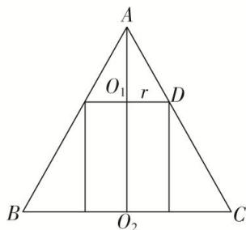

> [!faq]- 《专题06 立体几何中的面积与体积问题-立体几何（文理通用）》例题解析
>
> > [!success]- **【答案】** B
>
> > [!note]- **【分析】**
> > 本题未单列分析。
>
> > [!note]- **【解析】**
> > 答案 B 解析 圆锥的轴截面如图所示，设圆柱底面半径为 r，其中 0<r<2。由题意可知 $\triangle AO_{1}D\sim\triangle AO_{2}C$ ，则有 $\frac{AO_{1}}{O_{1}D}=\frac{AO_{2}}{O_{2}C}=2$ ，所以 $AO_{1}=2r$ ，则圆柱的高 h=4-2r，圆柱的侧面积 $S=2\pi r(4-2r)=4\pi(-r^{2}+2r)=4\pi$ ，整理得 $r^{2}-2r+1=0$ ，解得 r=1。当 r=1 时，h=2，所以该圆柱的体积 $V=\pi r^{2}h=2\pi$ 。故选 B.
> > 
