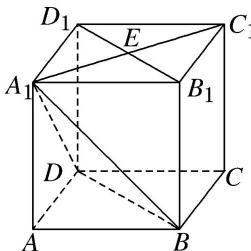
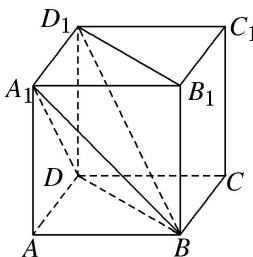

> [!faq]- 《专题06 立体几何中的面积与体积问题-立体几何（文理通用）》例题解析
>
> > [!success]- **【答案】** 详见解析
>
> > [!note]- **【分析】**
> > 本题未单列分析。
>
> > [!note]- **【解析】**
> > 答案 解析 法一：直接法 连接 $A_{1}C_{1}$ 交 $B_{1}D_{1}$ 于点 $E$ ，则 $A_{1}E \perp B_{1}D_{1}, A_{1}E \perp BB_{1}$ ，则 $A_{1}E \perp$ 平面 $BB_{1}D_{1}D$ ，所以 $A_{1}E$ 为四棱锥 $A_{1} - BB_{1}D_{1}D$ 的高，且 $A_{1}E = \frac{\sqrt{2}}{2}$ ，矩形 $BB_{1}D_{1}D$ 的长和宽分别为 $\sqrt{2}, 1$ ，故 $V_{A_1}$ $_{-BB_1D_1D} = \frac{1}{3} \times (1 \times \sqrt{2}) \times \frac{\sqrt{2}}{2} = \frac{1}{3}$ .
> >
> > 
> >
> > 
> >
> > 法二: 割补法 连接 $BD_{1}$ ，则四棱锥 $A_{1}-BB_{1}D_{1}D$ 分成两个三棱锥 $B-A_{1}DD_{1}$ 与 $BA_{1}B_{1}D_{1}$ ，所以 $V_{A_{1}BB_{1}D_{1}D}=V_{BA_{1}DD_{1}}+V_{BA_{1}B_{1}D_{1}}=\frac{1}{3}\times\frac{1}{2}\times1\times1\times1+\frac{1}{3}\times\frac{1}{2}\times1\times1\times1=\frac{1}{3}.$
