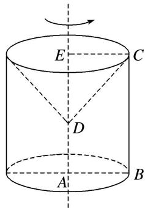

> [!faq]- 《专题06 立体几何中的面积与体积问题-立体几何（文理通用）》例题解析
>
> > [!success]- **【答案】** C
>
> > [!note]- **【解析】**
> > 答案 C 解析 如图，过点 C 作 CE 垂直 AD 所在直线于点 E，梯形 ABCD 绕 AD 所在直线旋转一周而形成的旋转体是由以线段 AB 的长为底面圆半径，线段 BC 为母线的圆柱挖去以线段 CE 的长为底面圆半径，ED 为高的圆锥，该几何体的体积为 $V = V_{圆柱} - V_{圆锥} = \pi \cdot AB^{2} \cdot BC - \frac{1}{3} \cdot \pi \cdot CE^{2} \cdot DE = \pi \times 1^{2} \times 2 - \frac{1}{3} \pi \times 1^{2} \times 1 = \frac{5\pi}{3}$ .
> >
> > 
