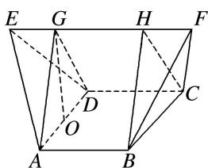

> [!faq]- 《专题06 立体几何中的面积与体积问题-立体几何（文理通用）》例题解析
>
> > [!success]- **【答案】** B
>
> > [!note]- **【分析】**
> > 本题未单列分析。
>
> > [!note]- **【解析】**
> > 答案 A 解析 如图，分别过点 $A$ ， $B$ 作 $EF$ 的垂线，垂足分别为 $G$ ， $H$ ，连接 $DG$ ， $CH$ ，容易求得 $EG = HF = \frac{1}{2}$ ， $AG = GD = BH = HC = \frac{\sqrt{3}}{2}$ ，取 $AD$ 的中点 $O$ ，连接 $GO$ ，易得 $GO = \frac{\sqrt{2}}{2}$ ， $\therefore S_{\triangle AGD} = S_{\triangle BHC} = \frac{1}{2} \times \frac{\sqrt{2}}{2} \times 1 = \frac{\sqrt{2}}{4}$ ， $\therefore$ 多面体的体积 $V = V_{\text{三棱锥 } E - ADG} + V_{\text{三棱锥 } F - BCH} + V_{\text{三棱柱 } AGD - BHC} = 2V_{\text{三棱锥 } E - ADG} + V_{\text{三棱柱 } AGD - BHC} = \frac{1}{3} \times \frac{\sqrt{2}}{4} \times \frac{1}{2} \times 2 + \frac{\sqrt{2}}{4} \times 1 = \frac{\sqrt{2}}{3}$ 。故选 A.
> > 
> > ## 【对点训练】
> > 1. 《九章算术》是我国古代第一部数学专著，它有如下问题：“今有圆堡瓏(cōng)，周四丈八尺，高一丈一尺．问积几何？”意思是“今有圆柱体形的土筑小城堡，底面周长为4丈8尺，高1丈1尺．问它的体积是多少？”(注：1丈=10尺，取π=3)( )
> > A. 704立方尺    B. 2112立方尺    C. 2115立方尺    D. 2118立方尺
> > 1. 答案 B 解析 设圆柱体底面半径为 r，高为 h，周长为 C．因为 $C=2\pi r$ ，所以 $r=\frac{C}{2\pi}$ ，因此 $V=\pi r^{2}h=\pi\frac{C^{2}}{4\pi^{2}}\cdot h=\frac{C^{2}h}{4\pi}=\frac{48^{2}\times11}{12}=2112$ （立方尺）.
