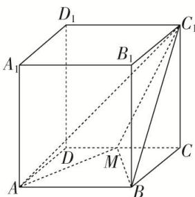

<!-- question-source:start -->
4. 如图，在棱长为 1 的正方体 $ABCD - A_1B_1C_1D_1$ 中， $M$ 为 $CD$ 的中点，则三棱锥 $A - BC_1M$ 的体积 $V_{A - BC_1M} = (\quad)$

A. $\frac{1}{2}$ B. $\frac{1}{4}$ C. $\frac{1}{6}$ D. $\frac{1}{12}$
<!-- question-source:end -->

![[高中/总复习/专题/立体几何/专题06 立体几何中的面积与体积问题-立体几何（文理通用）/考点02_几何体的体积问题/对点训练/answers/Q00039588A1.md]]
