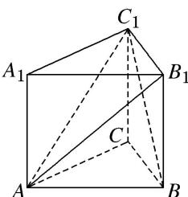

<!-- question-source:start -->
8. 如图所示, 已知三棱柱 $ABC - A_{1}B_{1}C_{1}$ 的所有棱长均为 1 , 且 $AA_{1} \perp$ 底面 $ABC$ , 则三棱锥 $B_{1} - ABC_{1}$ 的体积为 ( )

A. $\frac{\sqrt{3}}{12}$ B. $\frac{\sqrt{3}}{4}$ C. $\frac{\sqrt{6}}{12}$ D. $\frac{\sqrt{6}}{4}$
<!-- question-source:end -->

![[高中/总复习/专题/立体几何/专题06 立体几何中的面积与体积问题-立体几何（文理通用）/考点02_几何体的体积问题/对点训练/answers/Q00039592A1.md]]
