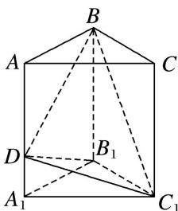

<!-- question-source:start -->
9. 如图, 已知正三棱柱 $ABC - A_{1}B_{1}C_{1}$ 的各棱长均为 2 , 点 $D$ 在棱 $AA_{1}$ 上, 则三棱锥 $D - BB_{1}C_{1}$ 的体积为 \_\_\_\_.

<!-- question-source:end -->

![[高中/总复习/专题/立体几何/专题06 立体几何中的面积与体积问题-立体几何（文理通用）/考点02_几何体的体积问题/对点训练/answers/Q00039593A1.md]]
