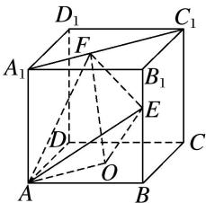

<!-- question-source:start -->
10. 如图所示，在正方体 $ABCD - A_{1}B_{1}C_{1}D_{1}$ 中，动点 $E$ 在 $BB_{1}$ 上，动点 $F$ 在 $A_{1}C_{1}$ 上， $O$ 为底面 $ABCD$ 的

中心，若 BE=x， $A_{1}F=y$ ，则三棱锥 O-AEF 的体积()

A. 与 $x, y$ 都有关 B. 与 $x, y$ 都无关 C. 与 $x$ 有关，与 $y$ 无关 D. 与 $y$ 有关，与 $x$ 无关
<!-- question-source:end -->

![[高中/总复习/专题/立体几何/专题06 立体几何中的面积与体积问题-立体几何（文理通用）/考点02_几何体的体积问题/对点训练/answers/Q00039594A1.md]]
