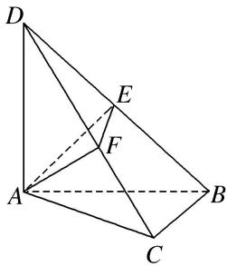

<!-- question-source:start -->
11. 如图, $\angle ACB = 90^{\circ}$ , $DA \perp$ 平面 $ABC$ , $AE \perp DB$ 交 $DB$ 于 $E$ , $AF \perp DC$ 交 $DC$ 于 $F$ , 且 $AD = AB = 2$ , 则三棱锥 $D - AEF$ 体积的最大值为 \_\_\_\_.

<!-- question-source:end -->

![[高中/总复习/专题/立体几何/专题06 立体几何中的面积与体积问题-立体几何（文理通用）/考点02_几何体的体积问题/对点训练/answers/Q00039595A1.md]]
