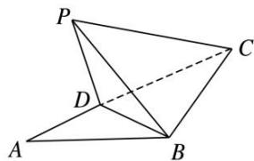

<!-- question-source:start -->
13. 如图, 在 $\triangle ABC$ 中, $AB=BC=2$ , $\angle ABC=120^{\circ}$ . 若平面 $ABC$ 外的点 $P$ 和线段 $AC$ 上的点 $D$ , 满足 $PD=DA$ , $PB=BA$ , 则四面体 $P-BCD$ 的体积的最大值是 \_\_\_\_.

<!-- question-source:end -->

![[高中/总复习/专题/立体几何/专题06 立体几何中的面积与体积问题-立体几何（文理通用）/考点02_几何体的体积问题/对点训练/answers/Q00039597A1.md]]
