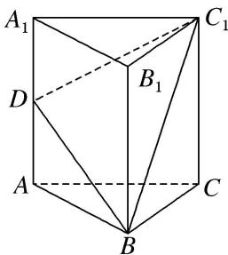

<!-- question-source:start -->
14. 如图, 在正三棱柱 $ABC - A_{1}B_{1}C_{1}$ 中, $D$ 为棱 $AA_{1}$ 的中点. 若 $AA_{1} = 4$ , $AB = 2$ , 则四棱锥 $B - ACC_{1}D$ 的体积为 \_\_\_\_.

<!-- question-source:end -->

![[高中/总复习/专题/立体几何/专题06 立体几何中的面积与体积问题-立体几何（文理通用）/考点02_几何体的体积问题/对点训练/answers/Q00039598A1.md]]
