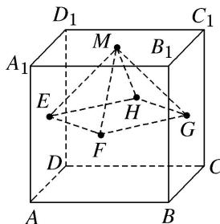

<!-- question-source:start -->
15. 已知正方体 $ABCD-A_{1}B_{1}C_{1}D_{1}$ 的棱长为 1，除面 ABCD 外，该正方体其余各面的中心分别为点 E，F，

G, H, M(如图), 则四棱锥 M-EFGH 的体积为 \_\_\_\_.

<!-- question-source:end -->

![[高中/总复习/专题/立体几何/专题06 立体几何中的面积与体积问题-立体几何（文理通用）/考点02_几何体的体积问题/对点训练/answers/Q00039599A1.md]]
