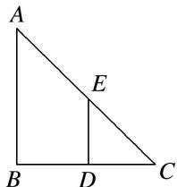

<!-- question-source:start -->
18. 如图，在 Rt△ABC 中，AB=BC=1，D 和 E 分别是边 BC 和 AC 上异于端点的点，DE⊥BC，将△CDE 沿 DE 折起，使点 C 到点 P 的位置，得到四棱锥 P-ABDE，则四棱锥 P-ABDE 的体积的最大值为 \_\_\_\_.

<!-- question-source:end -->

![[高中/总复习/专题/立体几何/专题06 立体几何中的面积与体积问题-立体几何（文理通用）/考点02_几何体的体积问题/对点训练/answers/Q00039602A1.md]]
