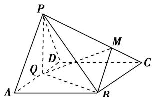
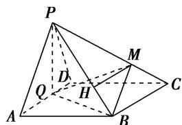

<!-- question-source:start -->
19. 如图，在四棱锥 $P - ABCD$ 中，底面 $ABCD$ 为菱形， $\angle BAD = 60^{\circ}$ ， $Q$ 为 $AD$ 的中点．若平面 $PAD \perp$ 平面 $ABCD$ ， $PA = PD = AD = 2$ ，点 $M$ 在线段 $PC$ 上，且 $PM = 2MC$ ，则四棱锥 $P - ABCD$ 与三棱锥 $P - QBM$ 的体积之比是 \_\_\_\_.

<!-- question-source:end -->

![[高中/总复习/专题/立体几何/专题06 立体几何中的面积与体积问题-立体几何（文理通用）/考点02_几何体的体积问题/对点训练/answers/Q00039603A1.md]]
