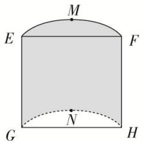

<!-- question-source:start -->
20. 如图, 用平行于母线的竖直平面截一个圆柱, 得到底面为弓形的圆柱体的一部分, 其中 $M$ , $N$ 为弧, 的中点, $\angle EMF = 120^{\circ}$ , 且 $\frac{\sqrt{3}}{3} EF + EG = 6$ , 当所得几何体的体积最大值时, 该几何体的高为 \_\_\_\_.

<!-- question-source:end -->

![[高中/总复习/专题/立体几何/专题06 立体几何中的面积与体积问题-立体几何（文理通用）/考点02_几何体的体积问题/对点训练/answers/Q00039604A1.md]]
