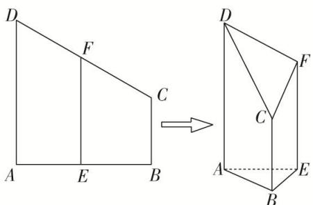

<!-- question-source:start -->
21. 如图, 在直角梯形 $ABCD$ 中, $AD = AB = 4$ , $BC = 2$ , 沿中位线 $EF$ 折起, 使得 $\angle AEB$ 为直角, 连接 $AB$ , $CD$ , 则所得的几何体的表面积为 , 体积为 .

<!-- question-source:end -->

![[高中/总复习/专题/立体几何/专题06 立体几何中的面积与体积问题-立体几何（文理通用）/考点02_几何体的体积问题/对点训练/answers/Q00039605A1.md]]
