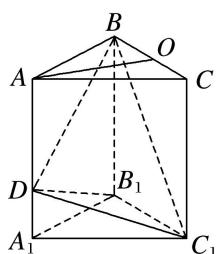

> [!faq]- 《专题06 立体几何中的面积与体积问题-立体几何（文理通用）》例题解析
>
> > [!success]- **【答案】** 详见解析
>
> > [!note]- **【分析】**
> > 本题未单列分析。
>
> > [!note]- **【解析】**
> > 答案 $\frac{2\sqrt{3}}{3}$ 解析 如图，取 $BC$ 的中点 $O$
> > 
> > 连接 AO. ∵ 正三棱柱 $ABC-A_{1}B_{1}C_{1}$ 的各棱长均为 2, ∴ AC=2, OC=1, 则 $AO=\sqrt{3}$ . ∵ $AA_{1} \parallel$ 平面 $BCC_{1}B_{1}$ , ∴ 点 D 到平面 $BCC_{1}B_{1}$ 的距离为 $\sqrt{3}$ . 又 $S_{\triangle BB_{1}C_{1}}=\frac{1}{2}\times2\times2=2$ , ∴ $V_{D-BB_{1}C_{1}}=\frac{1}{3}\times2\times\sqrt{3}=\frac{2\sqrt{3}}{3}$ .
