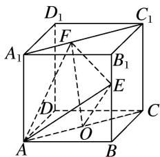

> [!faq]- 《专题06 立体几何中的面积与体积问题-立体几何（文理通用）》例题解析
>
> > [!success]- **【答案】** B
>
> > [!note]- **【分析】**
> > 本题未单列分析。
>
> > [!note]- **【解析】**
> > 答案 B 解析 由已知得 $V_{\text{三棱锥 } O-AEF} = V_{\text{三棱锥 } E-OAF} = \frac{1}{3} S_{\triangle AOF} \cdot h (h \text{ 为点 } E \text{ 到平面 } AOF \text{ 的距离})$ . 连接 $OC$ ，因为 $BB_1 //$ 平面 $ACC_1A_1$ ，所以点 $E$ 到平面 $AOF$ 的距离为定值。又 $AO // A_1C_1$ ， $OA$ 为定值，点 $F$ 到直线 $AO$ 的距离也为定值，所以 $\triangle AOF$ 的面积是定值，所以三棱锥 $O-AEF$ 的体积与 $x, y$ 都无关。
> >
> > 
