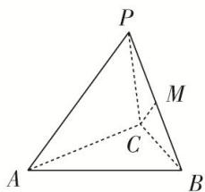

> [!faq]- 《专题06 立体几何中的面积与体积问题-立体几何（文理通用）》例题解析
>
> > [!success]- **【答案】** D
>
> > [!note]- **【分析】**
> > 本题未单列分析。
>
> > [!note]- **【解析】**
> > 答案 D 解析 如图, 取 $PB$ 中点 $M$ , 连接 $CM$ , $\because$ 平面 $PBC \perp$ 平面 $ABC$ , 平面 $PBC \cap$ 平面 $ABC = BC$ , $AC \subset$ 平面 $ABC$ , $AC \perp BC$ , $\therefore AC \perp$ 平面 $PBC$ , 设点 $A$ 到平面 $PBC$ 的距离为 $h = AC = 2x$ , $\because PC = BC = 2$ , $PB = 2x (0 < x < 2)$ , $M$ 为 $PB$ 的中点, $\therefore CM \perp PB$ , $CM = \sqrt{4 - x^2}$ , 解得 $S_{\triangle PBC} = \frac{1}{2} \times 2x \times \sqrt{4 - x^2} =$ $x\sqrt{4-x^{2}}$ ， $V_{A-PBC}=\frac{1}{3}\times(x\sqrt{4-x^{2}})\times2x=\frac{2x^{2}\sqrt{4-x^{2}}}{3}$ ，设 $t=\sqrt{4-x^{2}}(0<t<2)$ ，则 $x^{2}=4-t^{2}$ ， $\therefore V_{A-PBC}=\frac{2t(4-t^{2})}{3}=\frac{8t-2t^{3}}{3}(0<t<2)$ ，关于t求导，得 $V'(t)=\frac{8-6t^{2}}{3}$ ，令 $V'(t)=0$ ，解得 $t=\frac{2\sqrt{3}}{3}$ 或 $t=-\frac{2\sqrt{3}}{3}$ （舍去），当 $0<t<\frac{2\sqrt{3}}{3}$ 时， $V'(t)>0$ ，V(t)单调递增，当 $\frac{2\sqrt{3}}{3}<t<2$ 时， $V'(t)<0$ ，V(t)单调递减．所以当 $t=\frac{2\sqrt{3}}{3}$ 时， $(V_{A-PBC})_{\max}=\frac{32\sqrt{3}}{27}$ ．故选D.
> > 
