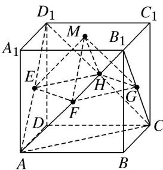

> [!faq]- 《专题06 立体几何中的面积与体积问题-立体几何（文理通用）》例题解析
>
> > [!success]- **【答案】** 详见解析
>
> > [!note]- **【分析】**
> > 本题未单列分析。
>
> > [!note]- **【解析】**
> > 答案 $\frac{1}{12}$ 解析 连接 $AD_{1}, CD_{1}, B_{1}A, B_{1}C, AC$ ，因为 $E, H$ 分别为 $AD_{1}, CD_{1}$ 的中点，所以 $EH // AC, EH = \frac{1}{2} AC$ ，因为 $F, G$ 分别为 $B_{1}A, B_{1}C$ 的中点，所以 $FG // AC, FG = \frac{1}{2} AC$ ，所以 $EH // FG, EH = FG$ ，所以四边形 $EHGF$ 为平行四边形，又 $EG = HF, EH = HG$ ，所以四边形 $EHGF$ 为正方形，又点 $M$ 到平面 $EHGF$ 的距离为 $\frac{1}{2}$ ，所以四棱锥 $M - EFGH$ 的体积为 $\frac{1}{3} \times \left(\frac{\sqrt{2}}{2}\right)^{2} \times \frac{1}{2} = \frac{1}{12}$ .
> >
> > 
