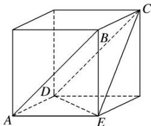

> [!faq]- 《专题06 立体几何中的面积与体积问题-立体几何（文理通用）》例题解析
>
> > [!success]- **【答案】** D
>
> > [!note]- **【分析】**
> > 本题未单列分析。
>
> > [!note]- **【解析】**
> > 答案 D 解析 多面体 ABCDE 为四棱锥(如图)，利用割补法可得其体积 $V=4-\frac{4}{3}=\frac{8}{3}$ ，故选 D.
> > 
