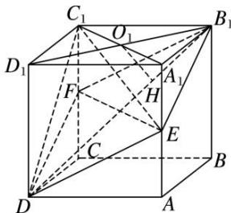

> [!faq]- 《专题06 立体几何中的面积与体积问题-立体几何（文理通用）》例题解析
>
> > [!success]- **【答案】** 详见解析
>
> > [!note]- **【解析】**
> > 答案 $\frac{1}{6} a^3$ 解析 方法一 如图所示，连接 $A_{1}C_{1}$ ， $B_{1}D_{1}$ 交于点 $O_{1}$ ，连接 $B_{1}D$ ， $EF$ ，过点 $O_{1}$ 作 $O_{1}H \perp B_{1}D$ 于点 $H$ 。因为 $EF \parallel A_{1}C_{1}$ ，且 $A_{1}C_{1} \notin$ 平面 $B_{1}EDF$ ， $EF \subset$ 平面 $B_{1}EDF$ ，所以 $A_{1}C_{1} \parallel$ 平面 $B_{1}EDF$ 。所以 $C_{1}$ 到平面 $B_{1}EDF$ 的距离就是 $A_{1}C_{1}$ 到平面 $B_{1}EDF$ 的距离。易知平面 $B_{1}D_{1}D \perp$ 平面 $B_{1}EDF$ ，又平面 $B_{1}D_{1}D \cap$ 平面 $B_{1}EDF = B_{1}D$ ，所以 $O_{1}H \perp$ 平面 $B_{1}EDF$ ，所以 $O_{1}H$ 等于四棱锥 $C_{1} - B_{1}EDF$ 的高。因为$\triangle B_{1}O_{1}H \sim \triangle B_{1}DD_{1}$ , 所以 $O_{1}H = \frac{B_{1}O_{1} \cdot DD_{1}}{B_{1}D} = \frac{\sqrt{6}}{6} a$ . 所以 $V_{C_1 - B_1EDF} = \frac{1}{3} S_{\text{四边形}B_1EDF} \cdot O_{1}H = \frac{1}{3} \times \frac{1}{2} EF \cdot B_{1}D \cdot O_{1}H = \frac{1}{3} \times \frac{1}{2} \sqrt{2} a \cdot \sqrt{3} a \cdot \frac{\sqrt{6}}{6} a = \frac{1}{6} a^{3}$ .
> >
> > 
> >
> > 方法二 连接 $EF, B_1D$ . 设 $B_1$ 到平面 $C_1EF$ 的距离为 $h_1, D$ 到平面 $C_1EF$ 的距离为 $h_2$ , 则 $h_1 + h_2 = B_1D_1 = \sqrt{2} a$ . 由题意得, $V_{\text{四棱锥 } C_1 - B_1EDF} = V_{\text{三棱锥 } B_1 - C_1EF} + V_{\text{三棱锥 } D - C_1EF} = \frac{1}{3} \cdot S_{\Delta C_1EF} \cdot (h_1 + h_2) = \frac{1}{6} a^3$ .
