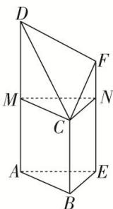
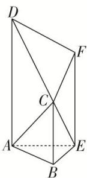
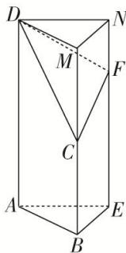

> [!faq]- 《专题06 立体几何中的面积与体积问题-立体几何（文理通用）》例题解析
>
> > [!success]- **【答案】** 详见解析
>
> > [!note]- **【分析】**
> > 本题未单列分析。
>
> > [!note]- **【解析】**
> > 答案 $14 + 6\sqrt{2} + \sqrt{6}$ 6 解析 如图，过点 $C$ 作 $CM$ 平行于 $AB$ ，交 $AD$ 于点 $M$ ，作 $CN$ 平行于 $BE$ ，交 $EF$ 于点 $N$ ，连接 $MN$ 。由题意可知四边形 $ABCM$ ， $BENC$ 都是矩形， $AM = DM = 2$ ， $CN = 2$ ， $FN = 1$ ， $AB = CM = 2\sqrt{2}$ ，
> >
> > 
> >
> > 
> >
> > 
> >
> > 所以 $S_{\triangle AEB} = \frac{1}{2}\times 2\times 2 = 2$ ， $S_{\text{梯形}ABCD} = \frac{1}{2}\times (2 + 4)\times 2\sqrt{2} = 6\sqrt{2}, S_{\text{梯形}BEFC} = \frac{1}{2}\times (2 + 3)\times 2 = 5, S_{\text{梯形}AEFD} = \frac{1}{2}\times (3+$ $4)\times 2 = 7$ ，在直角三角形CMD中， $CM = 2\sqrt{2}, MD = 2$ ，所以 $CD = 2\sqrt{3}$ .又因为 $DF = FC = \sqrt{5}$ ，所以 $S_{\triangle DFC}$ $= \frac{1}{2}\times 2\sqrt{3}\times \sqrt{2} = \sqrt{6}$ ，所以这个几何体的表面积为 $2 + 6\sqrt{2} +5 + 7 + \sqrt{6} = 14 + 6\sqrt{2} +\sqrt{6}.$
> >
> > 解法一：因为截面 CMN 把这个几何体分割为直三棱柱 ABE-MCN 和四棱锥 C-MNFD，又因为直三棱柱 ABE-MCN 的体积为 $V_{1}=S_{\triangle ABE}\cdot AM=\frac{1}{2}\times2\times2\times2=4$ ，四棱锥 C-MNFD 的体积为 $V_{2}=\frac{1}{3}S_{四边形MNFD}\cdot BE=\frac{1}{3}\times\frac{1}{2}\times(1+2)\times2\times2=2$ ，所以所求几何体的体积为 $V_{1}+V_{2}=6$ 。
> >
> > 解法二：如图，连接 $AC$ ， $EC$ ，则几何体分割为四棱锥 $C - ADFE$ 和三棱锥 $C - ABE$ ，因为 $V_{C - ADFE} = \frac{1}{3}\times \left(\frac{3 + 4}{2}\times 2\right)\times 2 = \frac{14}{3}, V_{C - ABE} = \frac{1}{3}\times \left(\frac{1}{2}\times 2\times 2\right)\times 2 = \frac{4}{3}$ ，所以所求几何体的体积为 $V_{C - ADFE} + V_{C - ABE} = \frac{14}{3} +\frac{4}{3} = 6.$ 解法三：如图，延长 $BC$ 至点 $M$ ，使得 $CM = 2$ ，延长 $EF$ 至点 $N$ ，使得 $FN = 1$ ，连接 $DM$ ， $MN$ ， $DN$ 得到直三棱柱 $ABE - DMN$ ，所以几何体的体积等于直三棱柱 $ABE - DMN$ 的体积减去四棱锥 $D - CMNF$ 的体积．因为 $V_{ABE - DMN} = \left(\frac{1}{2}\times 2\times 2\right)\times 4 = 8,V_{D - CMNF} = \frac{1}{3}\times \left(\frac{1 + 2}{2}\times 2\right)\times 2 = 2$ ，所以所求几何体的体积为 $V_{ABE - }$ $DMN - V_{D - CMNF} = 8 - 2 = 6.$
