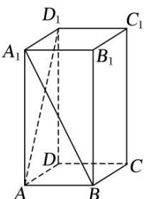

<!-- question-source:start -->
(2)如图, 在底面为正方形, 侧棱垂直于底面的四棱柱 $ABCD - A_{1}B_{1}C_{1}D_{1}$ 中, $AA_{1} = 2AB = 2$ , 则异面直线 $A_{1}B$ 与 $AD_{1}$ 所成角的余弦值为 ( )

A. $\frac{1}{5}$ B. $\frac{2}{5}$ C. $\frac{3}{5}$ D. $\frac{4}{5}$
<!-- question-source:end -->

![[高中/总复习/专题/立体几何/专题07 立体几何中空间角的计算-立体几何（文理通用）/考点01_异面直线所成的角/例题/answers/Q00043554A1.md]]
