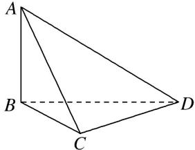

<!-- question-source:start -->
(3)在我国古代数学名著《九章算术》中，将四个面都为直角三角形的四面体称为鳖臑．如图，在鳖臑ABCD中， $AB \perp$ 平面BCD，且AB=BC=CD，则异面直线AC与BD所成角的余弦值为()

A. $\frac{1}{2}$ B. $-\frac{1}{2}$ C. $\frac{\sqrt{3}}{2}$ D. $-\frac{\sqrt{3}}{2}$
<!-- question-source:end -->

![[高中/总复习/专题/立体几何/专题07 立体几何中空间角的计算-立体几何（文理通用）/考点01_异面直线所成的角/例题/answers/Q00043555A1.md]]
