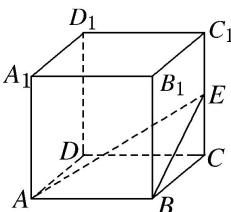

> [!faq]- 《专题07 立体几何中空间角的计算-立体几何（文理通用）》例题解析
>
> > [!success]- **【答案】** C
>
> > [!note]- **【解析】**
> > 答案 C 解析 如图，连接 BE，因为 $AB \parallel CD$ ，所以 AE 与 CD 所成的角为 $\angle EAB$ 。在 Rt△ABE 中，设 AB = 2，则 $BE = \sqrt{5}$ ，则 $\tan \angle EAB = \frac{BE}{AB} = \frac{\sqrt{5}}{2}$ ，所以异面直线 AE 与 CD 所成角的正切值为 $\frac{\sqrt{5}}{2}$ 。
> >
> > 
