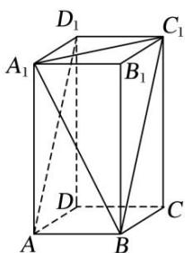

> [!faq]- 《专题07 立体几何中空间角的计算-立体几何（文理通用）》例题解析
>
> > [!success]- **【答案】** D
>
> > [!note]- **【分析】**
> > 本题未单列分析。
>
> > [!note]- **【解析】**
> > 答案 D 解析 连接 $BC_{1}$ , 易证 $BC_{1} // AD_{1}$ , 则 $\angle A_{1}BC_{1}$ 即为异面直线 $A_{1}B$ 与 $AD_{1}$ 所成的角. 连接 $A_{1}C_{1}$ , 由 $AB = 1$ , $AA_{1} = 2$ , 易得 $A_{1}C_{1} = \sqrt{2}$ , $A_{1}B = BC_{1} = \sqrt{5}$ , 故 $\cos \angle A_{1}BC_{1} = \frac{5 + 5 - 2}{2 \times \sqrt{5} \times \sqrt{5}} = \frac{4}{5}$ , 即异面直线 $A_{1}B$ 与 $AD_{1}$ 所成角的余弦值为 $\frac{4}{5}$ .
> > 
