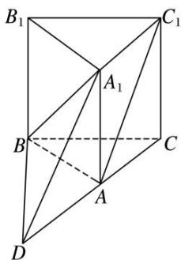

> [!faq]- 《专题07 立体几何中空间角的计算-立体几何（文理通用）》例题解析
>
> > [!success]- **【答案】** C
>
> > [!note]- **【分析】**
> > 本题未单列分析。
>
> > [!note]- **【解析】**
> > 答案 C 解析 如图，延长 CA 到点 D，使得 AD = AC，连接 $DA_{1}$ ，BD，则四边形 $ADA_{1}C_{1}$ 为平行四边形，所以 $\angle DA_{1}B$ 就是异面直线 $BA_{1}$ 与 $AC_{1}$ 所成的角。又 $A_{1}D = A_{1}B = DB$ ，所以 $\triangle A_{1}DB$ 为等边三角形，所以 $\angle DA_{1}B = 60^{\circ}$ 。故选 C.
> >
> > 
> >
> > ## 【对点训练】
