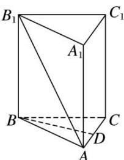

<!-- question-source:start -->
1. 如图所示，在正三棱柱 $ABC - A_{1}B_{1}C_{1}$ 中， $D$ 是 $AC$ 的中点， $AA_{1}:AB = \sqrt{2}:1$ ，则异面直线 $AB_{1}$ 与 $BD$ 所成的角为 \_\_\_\_.

<!-- question-source:end -->

![[高中/总复习/专题/立体几何/专题07 立体几何中空间角的计算-立体几何（文理通用）/考点01_异面直线所成的角/对点训练/answers/Q00039608A1.md]]
