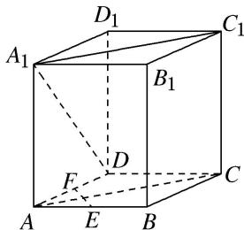

<!-- question-source:start -->
2. 如图所示, 在正方体 $ABCD - A_{1}B_{1}C_{1}D_{1}$ 中, 则 $AC$ 与 $A_{1}D$ 所成角的大小为\_\_\_\_; 若 $E$ , $F$ 分别为 $AB$ , $AD$ 的中点, 则 $A_{1}C_{1}$ 与 $EF$ 所成角的大小为\_\_\_\_.

<!-- question-source:end -->

![[高中/总复习/专题/立体几何/专题07 立体几何中空间角的计算-立体几何（文理通用）/考点01_异面直线所成的角/对点训练/answers/Q00039609A1.md]]
