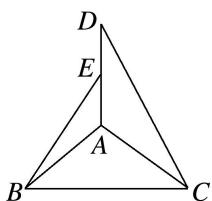

<!-- question-source:start -->
3. 如图所示, 等腰直角三角形 $ABC$ 中, $\angle A = 90^{\circ}$ , $BC = \sqrt{2}$ , $DA \perp AC$ , $DA \perp AB$ , 若 $DA = 1$ , 且 $E$ 为 $DA$ 的中点, 则异面直线 $BE$ 与 $CD$ 所成角的余弦值为 \_\_\_\_.

<!-- question-source:end -->
