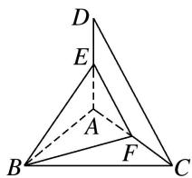

<!-- question-source:start -->
3. 如图所示，取 $AC$ 的中点 $F$ ，连接 $EF, BF$ ， $\because$ 在 $\triangle ACD$ 中， $E, F$ 分别是 $AD, AC$ 的中点， $\therefore EF \parallel CD$ . $\therefore \angle BEF$ 或其补角即为异面直线 $BE$ 与 $CD$ 所成的角．在 Rt $\triangle EAB$ 中， $AB = AC = 1, AE = \frac{1}{2} AD = \frac{1}{2}$ ， $\therefore BE = \frac{\sqrt{5}}{2}$ ．在 Rt $\triangle EAF$ 中， $AF = \frac{1}{2} AC = \frac{1}{2}, AE = \frac{1}{2}$ ， $\therefore EF = \frac{\sqrt{2}}{2}$ ．在 Rt $\triangle BAF$ 中， $AB = 1, AF = \frac{1}{2}$ ， $\therefore BF = \frac{\sqrt{5}}{2}$ ．在等腰三角形 $EBF$ 中， $\cos \angle FEB = \frac{\frac{1}{2} EF}{BE} = \frac{\frac{\sqrt{2}}{4}}{\sqrt{5}} = \frac{\sqrt{10}}{10}$ .

<!-- question-source:end -->
