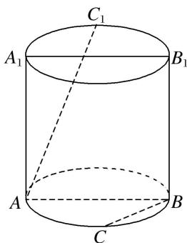

<!-- question-source:start -->
4. 如图, 已知圆柱的轴截面 $ABB_{1}A_{1}$ 是正方形, $C$ 是圆柱下底面弧 $AB$ 的中点, $C_{1}$ 是圆柱上底面弧 $A_{1}B_{1}$ 的中点, 那么异面直线 $AC_{1}$ 与 $BC$ 所成角的正切值为 \_\_\_\_.

<!-- question-source:end -->

![[高中/总复习/专题/立体几何/专题07 立体几何中空间角的计算-立体几何（文理通用）/考点01_异面直线所成的角/对点训练/answers/Q00039612A1.md]]
