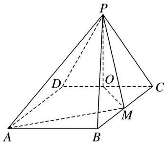

<!-- question-source:start -->
6. 如图，四边形 $ABCD$ 为矩形，平面 $PCD \perp$ 平面 $ABCD$ ，且 $PC = PD = CD = 2$ ， $BC = 2\sqrt{2}$ ， $O$ ， $M$ 分别为 $CD$ ， $BC$ 的中点，则异面直线 $OM$ 与 $PD$ 所成的角的余弦值为（）

A. $\frac{\sqrt{6}}{4}$ B. $\frac{\sqrt{6}}{3}$ C. $\frac{\sqrt{3}}{6}$ D. $\frac{\sqrt{3}}{3}$
<!-- question-source:end -->

![[高中/总复习/专题/立体几何/专题07 立体几何中空间角的计算-立体几何（文理通用）/考点01_异面直线所成的角/对点训练/answers/Q00039614A1.md]]
