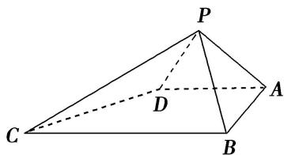

<!-- question-source:start -->
10. 如图所示, 在四棱锥 $P \quad ABCD$ 中, $\angle ABC = \angle BAD = 90^\circ$ , $BC = 2AD$ , $\triangle PAB$ 和 $\triangle PAD$ 都是等边三角形, 则异面直线 $CD$ 与 $PB$ 所成角的大小为 \_\_\_\_.

<!-- question-source:end -->

![[高中/总复习/专题/立体几何/专题07 立体几何中空间角的计算-立体几何（文理通用）/考点01_异面直线所成的角/对点训练/answers/Q00039617A1.md]]
