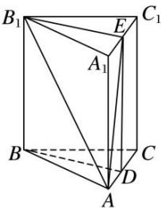

> [!faq]- 《专题07 立体几何中空间角的计算-立体几何（文理通用）》例题解析
>
> > [!success]- **【答案】** 详见解析
>
> > [!note]- **【分析】**
> > 本题未单列分析。
>
> > [!note]- **【解析】**
> > 答案 $60^{\circ}$ 解析 取 $A_{1}C_{1}$ 的中点 $E$ ，连接 $B_{1}E$ ， $ED$ ， $AE$ ，在 Rt $\triangle AB_{1}E$ 中， $\angle AB_{1}E$ 为异面直线 $AB_{1}$
> >
> > 与 $BD$ 所成的角．设 $AB = 1$ ，则 $A_{1}A = \sqrt{2}$ ， $AB_{1} = \sqrt{3}$ ， $B_{1}E = \frac{\sqrt{3}}{2}$ ，故 $\angle AB_{1}E = 60^{\circ}$
> >
> > 
